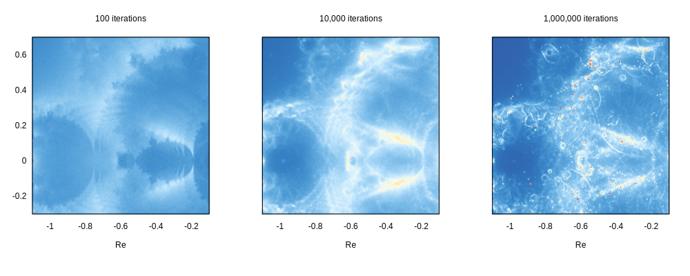

# The Buddhabrot Fractal in Rust

You may have heard of the [Mandelbrot fractal](https://en.wikipedia.org/wiki/Mandelbrot_set). It is a nice exercise to render the Mandelbrot fractal using your favourite language. The idea is to iterate the formula

$$z_{n+1} = z_n^2 + c,$$

And figure out how long it takes for this series to diverge. What is even nicer, is to actually plot the orbits $z_n$ for every $c$ and $z_0 = 0$ for which the series diverge.


This code uses the `ndarray` crate for numeric arrays, `num` for complex numbers, and `rayon` for parallel computing. The `clap` library is for command-line argument parsing, `indicatif` for creating progress bars.

``` {.rust #buddha-imports}
use rayon::prelude::*;
use rayon::join;
use indicatif::{ProgressBar, ParallelProgressIterator};
use rand::Rng;
use ndarray::{Array2, indices, s};
use num::{Complex, zero};
use clap::{Parser, ValueEnum};
use std::sync::atomic::{AtomicU8,Ordering};

use std::fs::File;
use std::io::Write;
```

<details><summary>Build executable</summary>

``` {.make #build}
cargo_args += --manifest-path=demo/buddhabrot/Cargo.toml
cargo_args += --release

target_path := demo/buddhabrot/target/release
buddhabrot := $(target_path)/buddhabrot

-include $(target_path)/buddhabrot.d
$(buddhabrot):
> cargo build $(cargo_args)
```

``` {.make #build target=docs/fig/buddha_render.jpg}
data/buddha_%.pgm: | $(buddhabrot)
> @mkdir -p $(@D)
> $(buddhabrot) -W 4096 -H 4096 -s 10 -m $(*F) --pgm $@

docs/fig/buddha_full.jpg: data/buddha_1000000.pgm data/buddha_10000.pgm data/buddha_100.pgm
> @mkdir -p $(@D)
> convert \( data/buddha_10000.pgm -level 15,45% \) \
          \( data/buddha_1000000.pgm -level 10,60% \) \
          \( data/buddha_100.pgm -level 20,65% \) \
          -set colorspace sRGB -combine -modulate 80,50,80 \
          -rotate -90 $@

docs/fig/buddha_render.jpg: docs/fig/buddha_full.jpg
> convert 'docs/fig/buddha_full.jpg[1920x1200+1200+1900]' $@
```

</details>

## TODO

- [ ] compile this code to WASM to create a web demo

## Plotter

The plotter has an interface that lets us call `p.plot(z, 1.0)`, where `z` is a complex number and `1.0` is a weight. The plotter has an array of pixels and info to map the complex plane to the pixels.

``` {.rust #buddha-image}
#[derive(Clone)]
struct ComplexImage<T: Sized> {
    pixels: Array2<T>,
    z_min: Complex<f64>,
    res: f64
}
```

<details><summary>Writing Gnuplot non-uniform matrix format</summary>

``` {.rust #buddha-image}
impl<T: Sized> ComplexImage<T> { 
    fn write_matrix<U, F>(&self, filename: &String, mapping: F) -> Result<(), Error> 
    where F: Fn(&T) -> U,
          U: ToString
    {
        let mut file = File::create(filename).map_err(Error::IO)?;
        let (w, _) = self.pixels.dim();
        fn stringify<T>(it: impl Iterator<Item=T>) -> String where T: ToString {
            it.fold(String::new(), |a, b| a + " " + &b.to_string())
        }
        writeln!(file, "{} {}", w, stringify((0..w).map(|i| i as f64 * self.res + self.z_min.re))).map_err(Error::IO)?;
        for (j, row) in self.pixels.columns().into_iter().enumerate() {
            writeln!(file, "{} {}",
                j as f64 * self.res + self.z_min.im,
                stringify(row.iter().map(&mapping))).map_err(Error::IO)?;
        }
        Ok(())
    }
}
```

</details>

The `Plotter` type is a newtype wrapper around `ComplexImage<f64>`. We will be seeing `ComplexImage` in a different context again.

``` {.rust #buddha-plotter}
#[derive(Clone)]
struct Plotter (ComplexImage<f64>);

impl Plotter {
    <<buddha-plotter-methods>>
}
```

We have a constructor setting the field to all zeros, and the `plot` method using what I know as Cloud-In-Cell method. This basically boils down to linear interpolation. Given $z$ we compute the grid coordinates by scaling and translating. Let $\tilde{z} = x + iy$ be the grid coordinate for our point. First we round down the grid coordinates to the nearest integer value $i = \lfloor x \rfloor$, then we find the  fractional values $x_f = i - \lfloor x \rfloor$ and $y_f = j - \lfloor y \rfloor$, and deposit signal by the following scheme:

|       |         $i$          |    $i + 1$     |
| :---: | :------------------: | :------------: |
|  $j$  | $(1 - x_f)(1 - y_f)$ | $x_f(1 - y_f)$ |
| $j+1$ |    $(1 - x_f)y_f$    |   $x_f y_f$    |

``` {.rust #buddha-plotter-methods}
fn new(width: usize, height: usize, center: Complex<f64>, res: f64) -> Plotter {
    Plotter(ComplexImage {
        pixels: Array2::zeros((width, height)),
        z_min:  center - Complex::new(width as f64 / 2.0, height as f64 / 2.0) * res,
        res
    })
}

fn plot(&mut self, z: Complex<f64>, w: f64) {
    let pz = (z - self.0.z_min) / self.0.res;
    let Complex { re, im } = pz;
    let i = re.floor() as usize;
    let j = im.floor() as usize;
    let (u, v) = self.0.pixels.dim();
    if i > (u-2) || j > (v - 2) {
        return;
    }

    let fx = re - i as f64;
    let fy = im - j as f64;

    self.0.pixels[[i    , j    ]] += w * (1.0 - fx) * (1.0 - fy);
    self.0.pixels[[i + 1, j    ]] += w *        fx  * (1.0 - fy);
    self.0.pixels[[i    , j + 1]] += w * (1.0 - fx) *        fy;
    self.0.pixels[[i + 1, j + 1]] += w *        fx  *        fy;
}
```

## Computing orbits

For each complex value `c`, we can compute the orbit for $z_{n+1} = z_n^2 + c$. If this orbit diverges, we want to plot the orbit to our image.

``` {.rust #buddha-orbits}
struct Orbit {
    points: Vec<Complex<f64>>,
    diverged: bool
}

fn orbit(c: Complex<f64>, maxit: usize) -> Orbit {
    let mut z = Complex::new(0.0, 0.0);
    let mut points = Vec::with_capacity(maxit);
    for _ in 0..maxit {
        z = z*z + c;
        if (z * z.conj()).re > 4.0 {
            return Orbit { points, diverged: true }
        }
        points.push(z);
    }
    return Orbit { points, diverged: false }
}
```

## Subsampling

To accurately compute the Buddhabrot we need to sample a lot of points. Part of the attraction of the Buddhabrot, is that orbits can differ wildly, even when the seed value $c$ is off by a tiny amount. By randomizing the sub-sample, we get different results for complex conjugate $c$. This breaks the symmetry of the Buddhabrot rendering, which is part of the intrigue.

Note, the `mset` argument to this method is a pre-computed Mandelbrot set. More about that later!

``` {.rust #buddha-plotter-methods}
fn random_subsample<'a>(&self, mset: &'a ComplexImage<Cell>)
    -> impl Iterator<Item = Complex<f64>> + 'a
{
    let mut rng = rand::thread_rng();
    let top_left = self.0.z_min.clone();
    let res = self.0.res;
    indices(self.0.pixels.dim()).into_iter().filter(
        |(i, j)| mset.pixels[(*i, *j)].face() != SimplexState::Inside
    ).map(
        move |(x, y)| {
            let dx: f64 = rng.gen();
            let dy: f64 = rng.gen();
            Complex::new((x as f64 + dx) * res, (y as f64 + dy) * res) + top_left 
        }
    )
}
```

!!! info "Balancing parallel loops"
    Often the best place to implement parallelism is in outer most loops. When we subsample each source pixel by adding a random offset, each subsample gets approximately the same amount of work load. After all, every iteration in the parallel loop computes a noisy version of the entire image. This means that our parallel loop will be well balanced.

!!! info "Parallel iterators in Rust"
    You hardly would notice that `par_subsample` does parallel computation! The only thing setting it appart is the `par_iter_mut` call. That being said, normally you would write this loop in a more readable `for` loop.

``` {.rust #buddha-plotter-methods}
fn par_compute(&mut self, mset: &ComplexImage<Cell>, n: usize, maxit: usize) {
    let mut pv = Vec::with_capacity(n*n);
    let w = 1.0 / (n * n) as f64;
    for _ in 0..(n*n) {
        pv.push(self.clone());
    }
    println!("Computing Buddhabrot orbits with {} subsamples per pixel.", n*n);
    pv.par_iter_mut().progress_count((n*n) as u64).for_each(|p| {
        for c in p.random_subsample(mset) {
            let o = orbit(c, maxit);
            if o.diverged {
                o.points.iter().for_each(|&z| p.plot(z, w));
            }
        }
    });
    for sv in pv {
        self.0.pixels += &sv.0.pixels;
    }
}
```

<details><summary>Save PGM image</summary>

``` {.rust #buddha-plotter-methods}
fn save_pgm(&self, g: GrayscaleMap, filename: &String) -> Result<(), Error> {
    let mut file = File::create(filename).map_err(Error::IO)?;
    let (w, h) = self.0.pixels.dim();
    write!(file, "P5 {} {} 65535\n", w, h).map_err(Error::IO)?;
    let values = match g {
        GrayscaleMap::LINEAR => self.0.pixels.clone(),
        GrayscaleMap::LOG => self.0.pixels.map(|x| (x + 1.0).log10()),
        GrayscaleMap::SQRT => self.0.pixels.map(|x| x.sqrt())
    };
    let max_value = values.iter().reduce(|x, y| if x > y {x} else {y}).ok_or(Error::Value("empty image".to_string()))?;
    values.iter().try_for_each(|x| -> Result<(), Error> {
        let v = (x * 65535.999 / max_value).floor() as u16;
        file.write_all(&v.to_be_bytes()).map_err(Error::IO)?;
        Ok(())
    })?;
    Ok(())
}
```

</details>

<details><summary>Main executable</summary>

``` {.rust file=demo/buddhabrot/src/main.rs}
<<buddha-imports>>

#[derive(Debug)]
enum Error {
    IO(std::io::Error),
    Value(String)
}

<<buddha-image>>
<<buddha-plotter>>
<<buddha-orbits>>
<<buddha-precompute>>

#[derive(Debug, Copy, Clone, PartialEq, Eq, PartialOrd, Ord, ValueEnum)]
enum GrayscaleMap {
    LOG, SQRT, LINEAR
}

#[derive(Debug, Parser)]
#[command(version, about)]
struct Cli {
    #[arg(short = 'W', long, default_value_t = 512)]
    width: usize,
    #[arg(short = 'H', long, default_value_t = 512)]
    height: usize,
    #[arg(short, long, default_value_t = 256)]
    maxit: usize,
    #[arg(short, long, default_value_t = 4)]
    subsample: usize,

    #[arg(long)]
    mset: Option<String>,

    /// Grayscale mapping for PGM files
    #[arg(short, long, value_enum, default_value_t = GrayscaleMap::SQRT)]
    grayscale: GrayscaleMap,

    /// Name of Gnuplot output file
    #[arg(long)]
    gnuplot: Option<String>,

    /// Root name of output 16-bit binary PGM files
    #[arg(long)]
    pgm: Option<String>
}

fn main() -> Result<(), Error> 
{
    let args = Cli::parse();
    let mut p = Plotter::new(
        args.width,
        args.height,
        Complex::new(0.0, 0.0),
        4.0 / (args.width as f64));

    let mset = ComplexImage::<Cell>::compute(args.width, args.height, p.0.z_min, p.0.res, args.maxit, args.subsample);
    if let Some(filename) = args.mset {
        mset.write_matrix(&filename, |x| x.get())?;
    }
    p.par_compute(&mset, args.subsample, args.maxit);
    if let Some(pgm_root) = args.pgm {
        p.save_pgm(args.grayscale, &pgm_root)?;
    }
    if let Some(filename) = args.gnuplot {
        p.0.write_matrix(&filename, |&x| x)?;
    }
    println!("Done!");
    Ok(())
}
```

</details>

## Iteration count

The Buddhabrot changes a lot when we vary the maximum number of iterations. When we raise the number of iterations, more points are detected to diverge, and these tend to dominate the image since they keep on going for much longer before diverging.



<details><summary>Plotting code</summary>

``` {.make #build target=docs/fig/buddha_iterations.svg}
data/buddha%.dat: | $(buddhabrot)
> @mkdir -p $(@D)
> $(buddhabrot) -W 1024 -H 1024 -m $(*F) -s 10 --gnuplot $@

docs/fig/buddha_iterations.svg: \
    demo/plot_buddha_iters.gp \
    data/buddha0000100.dat \
    data/buddha0010000.dat \
    data/buddha1000000.dat
> @mkdir -p $(@D)
> gnuplot $< > $@
```

``` {.gnuplot #blue-red-palette}
rcol(x) = 0.237 - 2.13*x + 26.92*x**2 - 65.5*x**3 + 63.5*x**4 - 22.36*x**5
gcol(x) = ((0.572 + 1.524*x - 1.811*x**2)/(1 - 0.291*x + 0.1574*x**2))**2
bcol(x) = 1/(1.579 - 4.03*x + 12.92*x**2 - 31.4*x**3 + 48.6*x**4 - 23.36*x**5)
set palette model RGB functions rcol(gray), gcol(gray), bcol(gray)
```

``` {.gnuplot file=demo/plot_buddha_iters.gp}
set term svg size 1000 400
<<blue-red-palette>>
set size ratio -1
set xlabel "Re"
set ylabel "Im"
# set log cb
set xrange [-1.1:-0.1]
set yrange [-0.3:0.7]
unset key; unset colorbox
set bmargin 5
set lmargin 5
set multiplot layout 1, 3
set cbrange [1:25]
set title "100 iterations"
plot 'data/buddha0000100.dat' matrix nonuniform u 1:2:($3+1) w image
unset ytics; unset ylabel
set cbrange [1:50]
set title "10,000 iterations"
plot 'data/buddha0010000.dat' matrix nonuniform u 1:2:($3+1) w image
set cbrange [1:100]
set title "1,000,000 iterations"
plot 'data/buddha1000000.dat' matrix nonuniform u 1:2:($3+1) w image
unset multiplot
```

``` {.make file=Makefile}
.RECIPEPREFIX = >

<<build>>
```

</details>

## Optimizing Buddhabrot

The naive implementation of the Buddhabrot fractal is a bit slow. Most of the time is actually spent on points that lie inside the Mandelbrot set. These points never diverge, so we need to compute the full `maxit` number of iterations, then not to use the result because we're only plotting diverging orbits.

The Mandelbrot set $M$ has a nice property that it is simply connected (see for instance [this proof](http://www.math.brown.edu/jk17/mconn.pdf)). That means that if we find a loop that is fully contained in $M$, all points enclosed by the loop are also in $M$. By subsampling the boundary of a region, we can make a reasonable assumption about the interior. We can use this technique to do a precomputation of the Mandelbrot set.

This optimisation has brought down the run-time for a million iterations on a $1024^2$ grid down from more than two hours to just a few minutes on my laptop.

``` {.rust #buddha-precompute}
<<buddha-mandelbrot>>
<<buddha-simplex-state>>
<<buddha-cell>>
<<buddha-sample-area>>
```

We start by writing a test to see if a point $c$ is in $M$.

``` {.rust #buddha-mandelbrot}
fn mandelbrot_test(c: Complex<f64>, maxit: usize) -> bool {
    let mut z: Complex<f64> = zero();
    for _ in 0..maxit {
        z = z*z + c;
        if (z * z.conj()).re > 4.0 {
            return false;
        }
    }
    return true;
}
```

We keep track of wether regions are inside, or outside $M$, or if they intersect $\partial M$ using a four-state enum.

``` {.rust #buddha-simplex-state}
#[derive(Clone, Copy, Debug, PartialEq, Eq)]
enum SimplexState {
    Unknown, Outside, Mixed, Inside
}

use SimplexState::*;

impl SimplexState {
    fn from_u8(x: u8) -> Self {
        match x {
            0b00 => Self::Unknown,
            0b01 => Self::Outside,
            0b10 => Self::Mixed,
            0b11 => Self::Inside,
            _    => panic!("invalid number for simplex state")
        }
    }
}
```

### Cubical Complex

Now, we need to have a data structure by which we can keep track of the boundaries of pixels. A method that I borrowed from computational topology is to double the grid size: the dimension of each simplex is then given by the number of odd indices. Fully even indices, like `(0, 0)` or `(34, 42)` encode for vertices, half even indices like `(1, 0)` or `(56, 23)` encode for edges, and fully odd indices like `(1, 1)` or `(13, 37)` encode for faces. For each simplex we need to know if it is fully inside, fully outside, or intersecting the boundary of $M$. A fourth state is needed to encode that we don't know. For a single pixel all this information fits exactly in one byte.

#### Cell

We'll be computing the Mandelbrot set in parallel. The sub-division algorithm will write to different parts of the output array in parallel. There is no contention, since every two-bit of information is written to only once. To convince Rust of the same, I had to make the array from `AtomicU8`. As far as I understand, using `Ordering::Relaxed` together with integer data has a very small performance penalty.

``` {.rust #buddha-cell}
struct Cell (AtomicU8);

impl std::default::Default for Cell {
    fn default() -> Self {
        Cell(AtomicU8::new(0u8))
    }
}

#[allow(dead_code)]
impl Cell {
    // getters
    fn get(&self) -> u8 { self.0.load(Ordering::Relaxed) }
    fn vertex(&self) -> SimplexState { SimplexState::from_u8(self.get()        & 0b00000011 ) }
    fn x_edge(&self) -> SimplexState { SimplexState::from_u8((self.get() >> 2) & 0b00000011 ) }
    fn y_edge(&self) -> SimplexState { SimplexState::from_u8((self.get() >> 4) & 0b00000011 ) }
    fn   face(&self) -> SimplexState { SimplexState::from_u8((self.get() >> 6) & 0b00000011 ) }

    // setters
    fn set_vertex(&self, state: SimplexState) { self.0.fetch_or(state as u8, Ordering::Relaxed); }
    fn set_x_edge(&self, state: SimplexState) { self.0.fetch_or((state as u8) << 2, Ordering::Relaxed); }
    fn set_y_edge(&self, state: SimplexState) { self.0.fetch_or((state as u8) << 4, Ordering::Relaxed); }
    fn   set_face(&self, state: SimplexState) { self.0.fetch_or((state as u8) << 6, Ordering::Relaxed); }
}
```

#### Sample area

The `SampleArea` encodes the selection on the `ComplexImage`. 

``` {.rust #buddha-sample-area}
#[derive(Debug)]
struct SampleArea {
    imin: usize,
    imax: usize,
    jmin: usize,
    jmax: usize
}

impl SampleArea {
    fn size(&self) -> usize { (self.imax - self.imin) * (self.jmax - self.jmin) }
}
```

### Image subdivision

``` {.rust #buddha-precompute}
impl ComplexImage<Cell> {
    <<buddha-precompute-init>>
    <<buddha-precompute-step>>
    <<buddha-precompute-check-boundary>>
    <<buddha-precompute-split>>
}
```

The subdivision algorithm can now be implemented on top of `ComplexImage<Cell>`. This image needs to have size `(width + 1, height + 1)`, so that we room for the outer boundaries on the right and bottom.

``` {.rust #buddha-precompute-init}
fn compute(width: usize, height: usize, z_min: Complex<f64>, res: f64, maxit: usize, subs: usize) -> Self {
    println!("Pre-computing Mandelbrot set.");
    let progress = ProgressBar::new((width * height).try_into().unwrap());
    let obj = ComplexImage { 
        pixels: Array2::default((width+1, height+1)),
        z_min, res
    };
    let area = SampleArea { imin: 0, imax: width, jmin: 0, jmax: height };
    obj.step(&area, maxit, subs, progress);
    obj
}
```

Each step we check if the boundary is either fully inside or fully outside $M$. If so, then we mark the entire area accordingly. If we reach the level of a single cell, and the previous step didn't make the decision, we can mark a cell as mixed. Otherwise, we split the sample area in half, and continue with both halves.

!!! info
    We have a subdivision algorithm here. The canonical way to parallelize this in Rayon is with the `join` function. `join` is passed two arguments, both closures, and those arguments are possibly executed in different threads, depending on what Rayon thinks is best.

``` {.rust #buddha-precompute-step}
fn step(&self, area: &SampleArea, maxit: usize, n: usize, progress: ProgressBar) {
    match self.check_boundary(area) {
        SimplexState::Inside => {
            self.mark_area(area, Inside);
            progress.inc(area.size().try_into().unwrap());
            return;
        },
        SimplexState::Outside => {
            self.mark_area(area, Outside);
            progress.inc(area.size().try_into().unwrap());
            return;
        },
        _ => {}
    }

    if area.size() == 1 {
        self.mark_area(area, Mixed);
        progress.inc(1);
        return
    }

    if area.size() == 0 {  // shouldn't happen
        return
    }

    let (a, b) = self.split(area, maxit, n);
    join(|| self.step(&a, maxit, n, progress.clone()), 
         || self.step(&b, maxit, n, progress.clone()));
}

fn mark_area(&self, area: &SampleArea, state: SimplexState) {
    for cell in self.pixels.slice(s![area.imin..area.imax,area.jmin..area.jmax]) {
        cell.set_face(state);
    }
}
```

#### Plots

We may observe how the algorithm is doing when we plot the edge component of the image. Note that many of the cells that contain tendrils are misidentified as being outside $M$. This is Ok though. What we don't want are misidentifications the other way around.


``` {.gnuplot file=demo/plot_buddha_subdiv.gp}
set term svg size 1000, 500
<<blue-red-palette>>
unset key
unset colorbox
set xlabel "Re"
set ylabel "Im"
set xrange [-0.5:0.5]
set yrange [0.2:1.2]

set multiplot layout 1, 2
set title "subdivisions"
plot 'data/buddha_precom.dat' matrix nonuniform u 1:2:(int($3) & 0x3C) w image
set title "classification"
plot 'data/buddha_precom.dat' matrix nonuniform u 1:2:(int($3) & 0xC0) w image
unset multiplot
```

``` {.make #build target=docs/fig/buddha_subdiv.svg}
data/buddha_precom.dat: | $(buddhabrot)
> @mkdir -p $(@D)
> $(buddhabrot) -W 1024 -H 1024 -s 10 -m 100000 --mset $@

docs/fig/buddha_subdiv.svg: demo/plot_buddha_subdiv.gp data/buddha_precom.dat
> @mkdir -p $(@D)
> gnuplot $< > $@
```

#### Implementation details

Checking boundaries or computing the split is important, but the code is not that exciting.

<details><summary>Check boundary</summary>

``` {.rust #buddha-precompute-check-boundary}
fn check_boundary(&self, area: &SampleArea) -> SimplexState {
    let top = self.pixels.slice(s![area.imin..area.imax,area.jmin]);
    let right = self.pixels.slice(s![area.imax,area.jmin..area.jmax]);
    let bottom = self.pixels.slice(s![area.imin..area.imax,area.jmax]);
    let left = self.pixels.slice(s![area.imin,area.jmin..area.jmax]);

    if  top.iter().all(   |c| c.x_edge() == Inside) &&
        right.iter().all( |c| c.y_edge() == Inside) &&
        bottom.iter().all(|c| c.x_edge() == Inside) &&
        left.iter().all(  |c| c.y_edge() == Inside) {
        return Inside;
    }

    if  top.iter().all(   |c| c.x_edge() == Outside) &&
        right.iter().all( |c| c.y_edge() == Outside) &&
        bottom.iter().all(|c| c.x_edge() == Outside) &&
        left.iter().all(  |c| c.y_edge() == Outside) {
        return Outside; 
    }

    Mixed
}
```

</details>

<details><summary>Splitting the sample area</summary>

``` {.rust #buddha-precompute-split}
fn horizontal_split(&self, area: &SampleArea, maxit: usize, n: usize) -> (SampleArea, SampleArea) {
    let b = (area.jmin + area.jmax) / 2;
    let y = self.z_min.im + (b as f64) * self.res;
    for a in area.imin..area.imax {
        let x = self.z_min.re + (a as f64) * self.res;
        let c = (0..n).map(
            |k| Complex::new(x + (k as f64 / n as f64) * self.res, y));
        let res: Vec<bool> = c.map(|c| mandelbrot_test(c, maxit)).collect();
        if res.iter().all(|&x| x) {
            self.pixels[(a, b)].set_x_edge(Inside);
        } else if res.iter().any(|&x| x) {
            self.pixels[(a, b)].set_x_edge(Mixed);
        } else {
            self.pixels[(a, b)].set_x_edge(Outside);
        }
    }
    ( SampleArea { jmax: b, ..*area }, SampleArea { jmin: b, ..*area } )
}

fn vertical_split(&self, area: &SampleArea, maxit: usize, n: usize) -> (SampleArea, SampleArea) {
    let a = (area.imin + area.imax) / 2;
    let x = self.z_min.re + (a as f64) * self.res;
    for b in area.jmin..area.jmax {
        let y = self.z_min.im + (b as f64) * self.res;
        let c = (0..n).map(
            |k| Complex::new(x, y + (k as f64 / n as f64) * self.res));
        let res: Vec<bool> = c.map(|c| mandelbrot_test(c, maxit)).collect();
        if res.iter().all(|&x| x) {
            self.pixels[(a, b)].set_y_edge(Inside)
        } else if res.iter().any(|&x| x) {
            self.pixels[(a, b)].set_y_edge(Mixed);
        } else {
            self.pixels[(a, b)].set_y_edge(Outside);
        }
    }
    ( SampleArea { imax: a, ..*area }, SampleArea { imin: a, ..*area} )
}

fn split(&self, area: &SampleArea, maxit: usize, n: usize) -> (SampleArea, SampleArea) {
    if (area.imax - area.imin) > (area.jmax - area.jmin) {
        self.vertical_split(area, maxit, n)
    } else {
        self.horizontal_split(area, maxit, n)
    }
}
```

</details>
