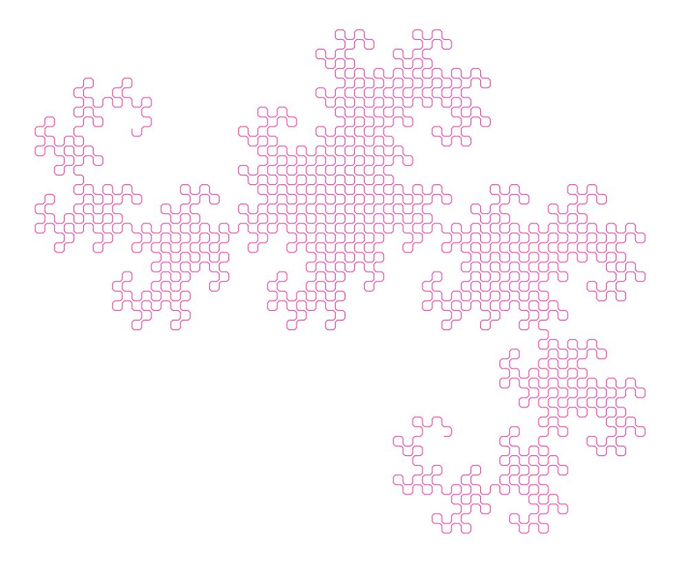
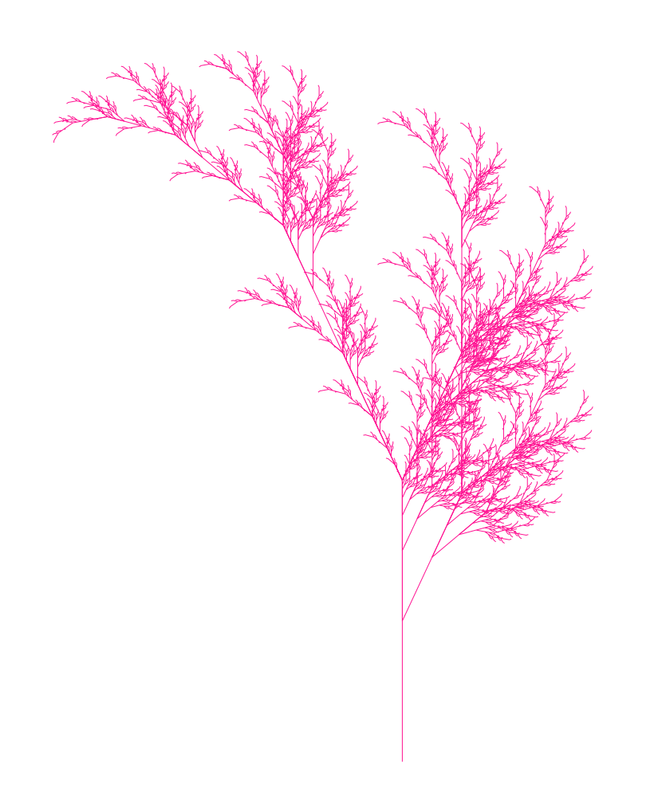
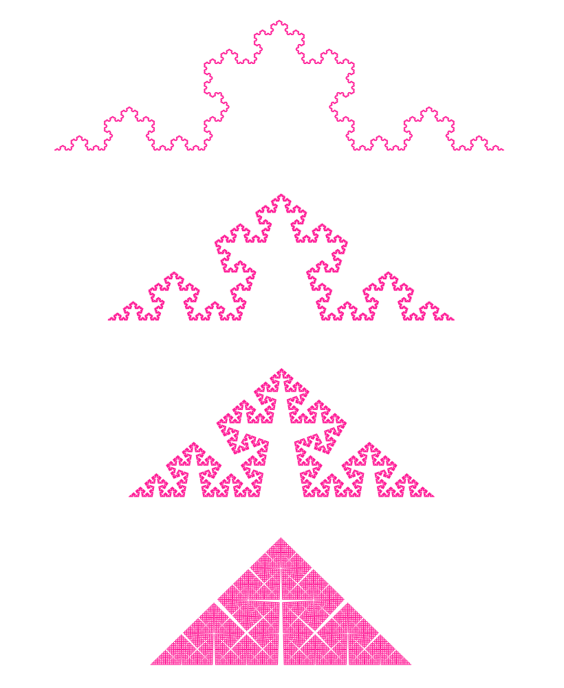

# L-Systems in Python

!!! abstract

    - :snake: Learn about generators in Python: sure you've heard about `yield`, now `yield from` is guaranteed to :exploding_head: blow your mind!
    - :knot: Learn how to generate tables and figures in Entangled: every output on this page is computed directly from the code you see.
    - :abacus: Learn how to generate fractal trees, they're pretty!

We'll program some L-systems, with the handicap that we're not allowed to buffer any points, only streams are alowed.

L-systems are fractals generated in a stringly fashion, by replacing elements of a string following a set of replacement rules. For instance, we can recreate the Sierspinsky triangle by starting with the string `F-G-G-H`, replacing `F` with `F-G+F+G-F` and `G` with `GG`.

``` {.python #l-systems}
sierspinsky = LSystem(
    axiom = "F-G-G",
    rules = {
        "F": "F-G+F+G-F",
        "G": "GG"
    },
    <<sierspinsky-commands>>
)
```

Running the first few iterations gives the following strings



<details><summary>Table code</summary>

``` {.python file=demo/sierspinsky_table.py}
from .lsystem import sierspinsky

if __name__ == "__main__":
    print("| generation | string | size |")
    print("| ---------- | ------ | ----:|")

    for i in range(7):
        gen = "".join(sierspinsky.expand(i))
        size = len(gen)
        gen_short = gen if size < 50 else gen[:24] + " ... " + gen[-24:]
        print(f"| {i} | `{gen_short}` | {size} |")
```

``` {.make #build target=include/sierspinsky-table.md}
include/sierspinsky-table.md: demo/sierspinsky_table.py demo/lsystem.py demo/turtle.py
> @mkdir -p $(@D)
> python -m demo.sierspinsky_table > $@
```

</details>

Now, each character in these strings are associated with a drawing command.

``` {.python #sierspinsky-commands}
commands = {
    "F": walk(1),
    "G": walk(1),
    "+": turn(-120),
    "-": turn(120)
}
```

Now, we get to see actual renderings of Sierspinsky's triangle.


<details><summary>Plotting code</summary>

``` {.gnuplot file=demo/preamble.gp}
set border lc rgb 'white' lw 0.5
set style line 1 lc rgb 'dark-pink' lt 1
set size ratio -1
unset xtics; unset ytics
unset key
```

``` {.gnuplot file=demo/plot_sierspinsky.gp}
set term svg size 1000 580
load 'demo/preamble.gp'
set multiplot layout 2, 3
set xrange [-0.1:1.1]; set yrange [-0.1:0.95]
plot '< python -c "from demo.lsystem import sierspinsky; sierspinsky.to_gnuplot(0)"' \
     u 1:2 w l t'gen 0' ls 1
set xrange [-0.2:2.2]; set yrange [-0.2:1.9]
plot '< python -c "from demo.lsystem import sierspinsky; sierspinsky.to_gnuplot(1)"' \
     u 1:2 w l t'gen 1' ls 1
set xrange [-0.4:4.4]; set yrange [-0.4:3.8]
plot '< python -c "from demo.lsystem import sierspinsky; sierspinsky.to_gnuplot(2)"' \
     u 1:2 w l t'gen 2' ls 1
set xrange [-0.8:8.8]; set yrange [-0.8:7.6]
plot '< python -c "from demo.lsystem import sierspinsky; sierspinsky.to_gnuplot(3)"' \
     u 1:2 w l t'gen 3' ls 1
set xrange [-1.6:17.6]; set yrange [-1.6:15.2]
plot '< python -c "from demo.lsystem import sierspinsky; sierspinsky.to_gnuplot(4)"' \
     u 1:2 w l t'gen 4' ls 1
set xrange [-3.2:35.2]; set yrange [-3.2:30.4]
plot '< python -c "from demo.lsystem import sierspinsky; sierspinsky.to_gnuplot(5)"' \
     u 1:2 w l t'gen 5' ls 1
unset multiplot
```

``` {.make #build target=docs/fig/sierspinsky.svg}
docs/fig/sierspinsky.svg: demo/plot_sierspinsky.gp demo/lsystem.py demo/preamble.gp demo/turtle.py
> @mkdir -p $(@D)
> gnuplot $< > $@
```

</details>

## Turtles
L-systems are usually rendered using Turtle graphics. We have a little turtle (imagined or not) behind our screen. This turtle caries a pen, can walk around and understands some commands. To visualize the path of the turtle, we need to convert this stateful walk into absolute coordinates.

We may represent coordinates on the screen using the `Point` class.

``` {.python #turtle-point}
@dataclass(frozen=True)
class Point:
    x: float
    y: float

    def __add__(self, other: Point) -> Point:
        return Point(self.x + other.x, self.y + other.y)

    def __iter__(self) -> Iterator[float]:
        return iter((self.x, self.y))
```

We will be streaming visited points to our plotting device. However, when the turtle lifts the pen up, it can move without drawing lines. In that case we can send and `EndMarker` to tell the plotter that the next point arriving starts a new path. Defining an empty class is a nifty way to define symbols in Python.

``` {.python #turtle-end-marker}
class EndMarker:
    pass
```

Now we can store the observable state of the turtle in `TurtleState`

``` {.python #turtle-state}
@dataclass
class TurtleState:
    pos: Point = Point(0.0, 0.0)
    direction: Point = Point(1.0, 0.0)
    pen_down: bool = True
```

The turtle is quite smart; it understands `save` and `restore` commands, and keeps a stack to save its state for later use.

``` {.python #turtle-turtle}
@dataclass
class Turtle:
    stack: list[TurtleState] = field(default_factory=lambda: [TurtleState()])

    @property
    def current(self):
        return self.stack[-1]

    def push(self):
        self.stack.append(copy(self.current))

    def pop(self):
        self.stack.pop()
```

### Commands
[{align=right}](https://commons.wikimedia.org/wiki/File:River_terrapin.jpg)

To control our turtle, we want to give it commands like `walk(0.8)` or `turn(-45)`, but we also want to make these commands composable, so that we may say `walk(0.8) >> turn(-45)`. You may be familiar with idioms where these actions are implemented as methods on the `Turtle` class. If each action returns a reference to the modified turtle (i.e. these methods `return self`), you can chain commands like so:

```python
t = Turtle()
t.walk(0.8).turn(-45).walk(0.2).turn(90)
```

This method of composition is nice as long as we cary around a reference to the turtle in question. But as you may have seen in (`sierspinky.commands`)[#sierspinsky-commands], we'd have to store composed functions as lambdas, saying: `action = lambda t: t.walk(0.8).turn(-45)`. Now we composed a function, and it returns the new turtle state, but further composition would look like `action(t).walk(0.2)`. Moreover, these lambdas don't compose in the same way that primitive commands do. Long story short, we'll have to define these methods as separate functions.

These functions need to manipulate the state of the turtle, and also emit points to the plotter and pass on the state to the next command. We can achieve this by making the commands be `Callable[[Turtle], Generator[Output, None, Turtle]]`. This means that we have a generator that takes a turtle as an argument, yields points and end-markers, and in the end returns a turtle.

``` {.python #turtle-composable}
T = TypeVar("T")
Output = Union[Point, Type[EndMarker]]
Command = Callable[[T], Generator[Output, None, T]]
```

We can make the `Command` type composable by wrapping it in a class.

``` {.python #turtle-composable}
class composable(Generic[T]):
    def __init__(self, f: Command[T]):
        self.f = f

    def __call__(self, obj: T) -> Generator[Output, None, T]:
        return (yield from self.f(obj))

    def __rshift__(self, other: composable[T]) -> composable[T]:
        def composed(obj: T) -> Generator[Output, None, T]:
            obj = yield from self.f(obj)
            obj = yield from other.f(obj)
            return obj

        return composable(composed)


def collect(t: Turtle, cmds: Iterable[Command]) -> Iterator[Output]:
    yield t.current.pos
    for c in cmds:
        t = yield from c(t)
    return t
```

Now we define commands for moving: `turn`, `pen_down`, `pen_up`, `walk`, `save`, `restore`, and the do-nothing `identity`. You may be asking: if we're modifying the turtle state anyway, why bother passing this state around? This functional style of programming is more robust. Each action could return a new `Turtle` object and the state can still be traced across the code. This style of coding, whether turtles are being mutated or not, is always safe, also in concurrent environments.

<details><summary>Turtle command implementations</summary>

``` {.python #turtle-imports}
from math import sin, cos, pi
from copy import copy
```

``` {.python #turtle-commands}
def turn(angle: float) -> composable:
    u = cos(angle * pi / 180.0)
    v = sin(angle * pi / 180.0)

    @composable
    def _turn(t: Turtle) -> Generator[Output, None, Turtle]:
        dx, dy = t.current.direction
        t.current.direction = Point(u * dx - v * dy, v * dx + u * dy)
        yield from ()
        return t

    return _turn


@composable
def pen_down(t: Turtle) -> Generator[Output, None, Turtle]:
    t.current.pen_down = True
    yield t.current.pos
    return t


@composable
def pen_up(t: Turtle) -> Generator[Output, None, Turtle]:
    t.current.pen_down = False
    yield EndMarker
    return t


def walk(dist: float) -> composable:
    @composable
    def _walk(t: Turtle) -> Generator[Output, None, Turtle]:
        x, y = t.current.pos
        dx, dy = t.current.direction
        t.current.pos = Point(x + dist * dx, y + dist * dy)
        if t.current.pen_down:
            yield t.current.pos
        return t

    return _walk


@composable
def save(t: Turtle) -> Generator[Output, None, Turtle]:
    t.push()
    yield from ()
    return t


@composable
def restore(t: Turtle) -> Generator[Output, None, Turtle]:
    t.pop()
    yield from ()
    return t


@composable
def identity(t: Turtle) -> Generator[Output, None, Turtle]:
    yield from ()
    return t
```

</details>

<details><summary>Turtle module</summary>

``` {.python file=demo/turtle.py}
from __future__ import annotations
from dataclasses import dataclass, field
from typing import Iterable, Generator, Callable, TypeVar, Union, Iterator, Generic, Type
<<turtle-imports>>

<<turtle-point>>
<<turtle-end-marker>>
<<turtle-state>>
<<turtle-turtle>>

<<turtle-composable>>
<<turtle-commands>>
```

</details>

## L-systems
Now that we have Turtle graphics in place, we can start to define L-systems. These systems consist of a starting string and replacement rules. We may iterate for any number of steps, replacing characters in the string with larger strings.

The following defines `LSystem` from an `axiom`, i.e. the initial condition, a set of replacement rules, and a mapping from characters to turtle drawing commands.

``` {.python file=demo/lsystem.py}
from __future__ import annotations
from typing import Optional, Iterable, Iterator
from dataclasses import dataclass
from .turtle import \
    Turtle, Point, EndMarker, Command, walk, turn, collect, \
    pen_down, pen_up, save, restore, identity


@dataclass
class LSystem:
    axiom: str
    rules: dict[str, str]
    commands: dict[str, Command[Turtle]]

    <<lsystem-methods>>


<<l-systems>>
```

The implementation of the `expand` method uses recursive `yield from` statements to expand strings. This way, the complete rendering of the L-system is never in memory: its generators, [all the way down](https://en.wikipedia.org/wiki/Turtles_all_the_way_down)!


``` {.python #lsystem-methods}
def expand(self, gen: int, inp: Optional[str] = None) -> Iterator[str]:
    inp = inp or self.axiom

    if gen == 0:
        yield from inp
        return

    for c in inp:
        yield from self.expand(gen - 1, self.rules.get(c, c))
```

The `run` method, iterates over all turtle commands.

``` {.python #lsystem-methods}
def run(self, gen: int) -> Iterable[Command[Turtle]]:
    return map(lambda x: self.commands.get(x, identity), self.expand(gen))
```

To actually visualize the result, we print the `x`, `y`, `z` values generated by the turtle, separated by newlines when the pen left the paper. This is an output format that Gnuplot understands.

``` {.python #lsystem-methods}
def to_gnuplot(self, gen: int):
    for p in collect(Turtle(), self.run(gen)):
        match p:
            case Point(x, y):
                print(x, y)
            case EndMarker:
                print()
```

### Dragon

``` {.python #l-systems}
dragon = LSystem(
    "F",
    {"F": "F+G", "G": "F-G"},
    {
        "F": walk(0.7),
        "+": turn(45) >> walk(0.35) >> turn(45),
        "-": turn(-45) >> walk(0.35) >> turn(-45),
        "G": walk(0.7),
    },
)
```



<details><summary>Plotting code</summary>

``` {.gnuplot file=demo/plot_dragon.gp}
set term svg size 1000 820
load 'demo/preamble.gp'
set xrange [-53:28]
set yrange [-14:52]
plot '< python -c "from demo.lsystem import dragon; dragon.to_gnuplot(11)"' \
     u 1:2 w l t'' ls 1
```

``` {.make #build target=docs/fig/dragon.svg}
docs/fig/dragon.svg: demo/plot_dragon.gp demo/lsystem.py demo/preamble.gp
> @mkdir -p $(@D)
> gnuplot $< > $@
```

</details>

### Barnsley Fern

``` {.python #l-systems}
barnsley_fern = LSystem(
    "X",
    {
        "X": "F+[[X]-X]-F[-FX]+X",
        "F": "FF"
    },
    {
        "F": walk(1.0),
        "+": turn(25),
        "-": turn(-25),
        "[": save,
        "]": pen_up >> restore >> pen_down
    }
)
```



<details><summary>Plotting code</summary>

``` {.gnuplot file=demo/plot_fern.gp}
set term svg size 820 1000
load 'demo/preamble.gp'
set xrange [-170:100]
set yrange [-10:340]
plot '< python -c "from demo.lsystem import barnsley_fern; barnsley_fern.to_gnuplot(7)"' \
     u 2:1 w l t'' ls 1
```

``` {.make #build target=docs/fig/fern.svg}
docs/fig/fern.svg: demo/plot_fern.gp demo/lsystem.py demo/preamble.gp
> @mkdir -p $(@D)
> gnuplot $< > $@
```

</details>

### Koch curve

``` {.python #l-systems}
def koch(angle):
    return LSystem(
        axiom = "F",
        rules = {
            "F": "F+F--F+F"
        },
        commands = {
            "F": walk(1),
            "+": turn(angle),
            "-": turn(-angle)
        })
```



<details><summary>Plotting code</summary>

``` {.gnuplot file=demo/plot_koch.gp}
set term svg size 820 1000
load 'demo/preamble.gp'
set multiplot layout 4, 1
set xrange [-50:2250]
set yrange [-50:670]
plot '< python -c "from demo.lsystem import koch; koch(60).to_gnuplot(7)"' \
     u 1:2 w l t'' ls 1
set xrange [-30:870]
set yrange [-30:330]
plot '< python -c "from demo.lsystem import koch; koch(72).to_gnuplot(7)"' \
     u 1:2 w l t'' ls 1
set xrange [-10:400]
set yrange [-10:180]
plot '< python -c "from demo.lsystem import koch; koch(80).to_gnuplot(7)"' \
     u 1:2 w l t'' ls 1
set xrange [-7:160]
set yrange [-7:80]
plot '< python -c "from demo.lsystem import koch; koch(88.5).to_gnuplot(7)"' \
     u 1:2 w l t'' ls 1
unset multiplot
```

``` {.make #build target=docs/fig/koch.svg}
docs/fig/koch.svg: demo/plot_koch.gp demo/lsystem.py demo/preamble.gp
> @mkdir -p $(@D)
> gnuplot $< > $@
```

</details>


<details><summary>Module code</summary>

``` {.python file=demo/__init__.py}

```

</details>
